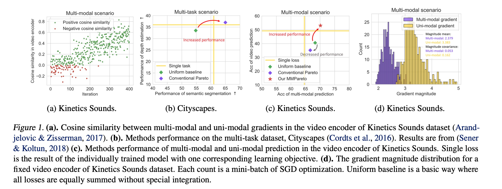

# Codes of MMPareto: Boosting Multimodal Learning with Innocent Unimodal Assistance

Here is the official PyTorch implementation of ''*MMPareto: Boosting Multimodal Learning with Innocent Unimodal Assistance*'', which observe and diminish the potential conflict between multimodal and unimodal learning objectives, balancing the unimodal learning. Please refer to our [ICML 2024 paper](https://arxiv.org/abs/2405.17730) for more details.

**Paper Title: "MMPareto: Boosting Multimodal Learning with Innocent Unimodal Assistance"**

**Authors: [Yake Wei](https://echo0409.github.io/), and [Di Hu](https://dtaoo.github.io/index.html)**

## Potential optimization conflict in multimodal framework
The imbalanced multimodal learning problem, where most multimodal models cannot jointly utilize all modalities well, limiting their performance, has raised attention recently. Several methods have been proposed to improve the training of worse learnt modality with additional module  or modality-specific training strategy. Among them, **multitask-like methods that directly add unimodal learning objectives besides the multimodal joint learning objective, exhibit their superior effectiveness for alleviating this imbalanced multimodal learning problem.**

However, behind the effective performance, we observe a previously ignored risk in model optimization under this widely used multitask-like scenario. **The optimization of parameters in unimodal encoder is influenced by both multimodal joint learning objective and its own unimodal learning objective.** This entails the need to minimize two learning objectives concurrently, but usually, there does not exist a set of parameters that could satisfy this goal. Consequently, these multimodal and unimodal learning objectives could have conflict during optimization. In Figure 1(a), we take an example of the video encoder on the widely used Kinetics Sounds dataset. As the results, negative cosine similarity indicates that multimodal and unimodal gradients indeed have conflicts in direction during optimization. 

    

To avoid optimization conflicts, it is essential to integrate both gradients well, making the unimodal gradient not affect the primary multimodal training but assist it. This necessity naturally accords with the idea of Pareto method, which aims to find a steep gradient direction that benefits all objectives and finally converges to a trade-off state of them. Pareto method has achieved ideal advancement in multi-task cases. However, **as Figure 1(c), in multimodal cases, the conventional Pareto method surprisingly loses its efficacy, even is worse than the uniform baseline, where all gradients are equally summed.**

In this paper, we propsoe MMPareto method to well address gradient conflicts in multimodal scenarios. It respectively takes the **direction** and **magnitude** into account during gradient integration. It ensures innocent unimodal assistance, where the final gradient is with direction common to all learning objectives and enhanced magnitude for improving generalization. 

## Code instruction

### Data Preparation
The original datasets can be found:
[CREMA-D](https://github.com/CheyneyComputerScience/CREMA-D),
[Kinetics-Sounds](https://github.com/cvdfoundation/kinetics-dataset),
[CG-MNIST](https://drive.usercontent.google.com/download?id=1NSv4RCSHjcHois3dXjYw_PaLIoVlLgXu&export=download&authuser=0),
[ModelNet40](https://modelnet.cs.princeton.edu/)

The data preprocessing follows [OGM-GE](https://github.com/GeWu-Lab/OGM-GE_CVPR2022).

### Run
The code use CREMA-D dataset as example. You can simply run the code using:  
<pre><code>
cd code
sh script/one_joint_loss.sh  
# One joint loss baseline
</code></pre>
<pre><code>
cd code
sh script/uniform_baseline.sh  
# Uniform baseline where all losses are euqally summed
</code></pre>
<pre><code>
cd code
sh script/mmpareto.sh  
# Our MMPareto method
</code></pre>

## Citation
If you find this work useful, please consider citing it.

<pre><code>
@inproceedings{wei2024innocent,
  title={MMPareto: boosting multimodal learning with innocent unimodal assistance},
  author={Wei, Yake and Hu, Di},
  booktitle={International Conference on Machine Learning},
  year={2024}
}
</code></pre>